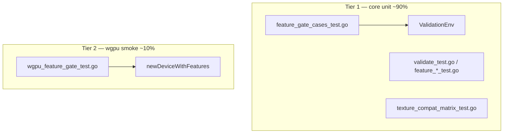

# Validation Testing Guide

> How feature gates, texture usage rules, and Phase C validation are tested in `wgpu/core`.  
> Issue: [#333](https://github.com/gogpu/wgpu/issues/333) · Implementation branch: `feat/validation-phase-c`

For the full implementation plan (phases, VAL-C IDs, wiring checklist), see the local dev doc  
[`docs/dev/validation-phase-c-plan.md`](dev/validation-phase-c-plan.md) (gitignored — not committed).  
RU version of this guide: [`VALIDATION-TESTING.ru.md`](VALIDATION-TESTING.ru.md).

---

## Goals

1. **Fast, deterministic unit tests** — no GPU required for ~90% of validation coverage.
2. **Typed errors** — negative tests assert `*core.FeatureError`, `*CreateTextureError`, etc., not just `err != nil`.
3. **Registry completeness** — new feature gates are added once to `AllFeatureRequirements` and wired in tests.
4. **Thin smoke layer** — `wgpu_test` verifies the public API path with real HAL (software/noop/Vulkan when available).

---

## Two-tier test pyramid



| Tier | Package | Backend | Use for |
|------|---------|---------|---------|
| **1** | `core/` + `core/testutil/` | No HAL / direct `Validate*` | Feature gates, descriptor validation, texture matrix |
| **2** | `wgpu` (`wgpu_test`) | Real HAL (`GOGPU_GRAPHICS_API=software` in CI) | Encode → Finish error path, `CreateQuerySet`, multi-draw |

**Rule:** bulk feature coverage lives in Tier 1. Tier 2 gets **1–2 smoke tests per feature group**, not 25 duplicate cases.

---

## `ValidationEnv` — test fixture (P9)

Location: [`core/testutil/validation_env.go`](../core/testutil/validation_env.go)

Lightweight **fixture builder**, not a DI framework. One instance per `t.Run`; safe with `t.Parallel()`.

```go
env := testutil.NewValidationEnv(t)                              // no optional features
env := testutil.NewValidationEnv(t, testutil.WithFeature(f))   // single feature
env := testutil.NewValidationEnv(t, testutil.WithFeatures(fs))   // feature set
env := testutil.NewValidationEnv(t, testutil.WithLimits(lims)) // custom limits
```

### Action helpers

Each method calls the corresponding `core.Validate*` (or related) function and returns `error` for table-driven negative tests:

| Method | Validates | VAL-C |
|--------|-----------|-------|
| `CreatePipelineLayoutWithPushConstants()` | Push constant ranges | C4 |
| `CreateTextureWithFormat(format, usage)` | Format feature gates | C6–C11 |
| `CreateRenderPipelineUnclippedDepth()` | Unclipped depth | C5 |
| `CreateShaderModuleWithWGSL(source)` | WGSL f16 / subgroup | C12, C19–C20 |
| `CreateQuerySetTimestamp()` | Timestamp queries | C24 |
| `CreateBindGroupWithR32FloatTexture()` | Float32 filterable | C21 |

**Extension model:** add a new scenario = add one method on `ValidationEnv`, then one `featureGateCase` row.

---

## Assertion helpers (P2)

Location: [`core/testutil/assert.go`](../core/testutil/assert.go)

```go
testutil.AssertFeatureError(t, err, gputypes.FeaturePushConstants, "CreatePipelineLayout")
testutil.AssertNoError(t, err)
```

Always use typed assertions in negative tests. Avoid bare `if err == nil`.

---

## Registry-driven feature gates (P10)

Location: [`core/feature_gate_cases_test.go`](../core/feature_gate_cases_test.go)

```go
type featureGateCase struct {
    name     string
    feature  gputypes.Feature
    resource string
    act      func(env *testutil.ValidationEnv) error
}
```

`TestFeatureGates` runs **two subtests per case**:

- `…/negative` — `NewValidationEnv(t)` with zero features → expect `*FeatureError`
- `…/positive` — `NewValidationEnv(t, WithFeature(tc.feature))` → expect nil

`TestFeatureGateCasesCoverRegistryTargets` guards that every wired Phase C feature appears in `featureGateCases`.

### Feature registry

Location: [`core/feature_validate.go`](../core/feature_validate.go)

- `RequireFeature(features, feature, resource)` — canonical gate helper (VAL-C0)
- `AllFeatureRequirements` — documents all 25 WebGPU features with `Resource` entry point + Rust reference
- `TestFeatureGateRegistryComplete` — no duplicate entries, non-empty metadata

---

## Pure `Validate*` unit tests (P1)

Location: [`core/validate_test.go`](../core/validate_test.go), [`core/feature_format_test.go`](../core/feature_format_test.go), etc.

For descriptor-only validation without a device:

```go
err := core.ValidateTextureDescriptor(desc, gputypes.DefaultLimits(), gputypes.Features(0))
if !core.IsFeatureError(err) { ... }
```

Use `validTextureDesc()` / similar factories from `validate_test.go` (P1).

---

## Texture usage matrix (P3 + P12)

Location: [`core/track/texture_compat_matrix_test.go`](../core/track/texture_compat_matrix_test.go)

Exhaustive combinatorial test: every non-empty `TextureUses` pair checked against `IsCompatible`, compared to an independent `referenceCompatible` function (P12 golden reference).

Runtime creation-time checks: [`core/texture_usage_validate.go`](../core/texture_usage_validate.go) (VAL-C14–C18), integrated in `ValidateTextureDescriptor`.

---

## Public API smoke tests (P6)

Location: [`wgpu_feature_gate_test.go`](../wgpu_feature_gate_test.go)

```go
newDeviceWithoutFeatures(t)                    // RequiredFeatures: 0
newDeviceWithFeatures(t, features)             // skips if adapter lacks feature
newEncoderWithRenderPassForDevice(t, device)   // requires HAL
```

Typical flow for draw-time gates:

1. Create device without feature
2. Record draw / indirect / count-buffer call on render pass
3. `encoder.Finish()` → expect `*core.FeatureError`

Integration-only gates (not in `featureGateCases`):

- `FeatureMultiDrawIndirect` — `MultiDrawIndirect` when `drawCount > 1`
- `FeatureIndirectFirstInstance` — `Draw` with `firstInstance != 0`
- `FeatureMultiDrawIndirectCount` — count-buffer indirect APIs (`MultiDrawIndirectCount`, `MultiDrawIndexedIndirectCount`)

---

## Multi-draw indirect count (VAL-C2)

Count-buffer indirect draw APIs are split across three layers; each layer has focused unit tests (no GPU):

| Layer | Production | Tests |
|-------|------------|-------|
| **HAL helper** | [`hal/indirect_count.go`](../hal/indirect_count.go) — `RecordIndirectCountMax` | [`hal/indirect_count_test.go`](../hal/indirect_count_test.go) |
| **Core encoder** | [`core/command_indirect_count.go`](../core/command_indirect_count.go) — `indirectCountInactive`, `DrawIndirectCount` forwarding | [`core/indirect_count_test.go`](../core/indirect_count_test.go) |
| **Public API** | [`renderpass_indirect_count.go`](../renderpass_indirect_count.go) — feature gate, buffer validation, HAL record | [`renderpass_indirect_count_test.go`](../renderpass_indirect_count_test.go) |

### `NewTestBuffer` (validation-only buffers)

Location: [`export_test.go`](../export_test.go)

Creates a `*Buffer` with `core` state only (`HAL == nil`). Use in Tier-1 tests that validate size, usage, offsets, and labels without a device or HAL:

```go
indirect := NewTestBuffer(64, gputypes.BufferUsageIndirect, "indirect")
count := NewTestBuffer(4, gputypes.BufferUsageIndirect, "count")
err := pass.validateIndirectCountBuffers(indirect, 0, count, 0, 2, drawIndirectRecordSize)
```

### What each test file covers

- **`hal/indirect_count_test.go`** — `RecordIndirectCountMax` forwards `maxDrawCount`, zero count is a no-op, count buffer is not passed to the record callback.
- **`core/indirect_count_test.go`** — `indirectCountInactive` (ended pass / zero count); core `DrawIndirectCount` / `DrawIndexedIndirectCount` forward to HAL once and skip nil buffer, ended pass, or zero count.
- **`renderpass_indirect_count_test.go`** — table-driven `validateIndirectCountBuffers` (alignment, usage, span overrun); `validateIndexedIndirectCountPreconditions` (missing index buffer, strip format mismatch).

Tier-2 smoke for the feature gate: `TestFeatureGate_MultiDrawIndirectCount` in [`wgpu_feature_gate_test.go`](../wgpu_feature_gate_test.go) (encode → `Finish()` → `*core.FeatureError`).

```bash
go test ./hal/... ./core/... . -run 'IndirectCount|ValidateIndirect|RecordIndirectCount' -count=1
```

---

## Test pattern reference (P1–P12)

| ID | Pattern | When to use | Primary file |
|----|---------|-------------|--------------|
| **P1** | Valid factory | Pure `Validate*` | `validate_test.go` |
| **P2** | Typed error assert | Every negative test | `core/testutil/assert.go` |
| **P3** | Table-driven + `t.Parallel()` | Combinatorial matrices | `texture_compat_matrix_test.go` |
| **P4** | Mock HAL | Core unit tests via env | `ValidationEnv` |
| **P5** | Device tracker | Submit-time usage conflicts | `device_tracker_test.go` |
| **P6** | `newDeviceWithFeatures` | Public API smoke | `wgpu_feature_gate_test.go` |
| **P7** | Mock context | Package-local (raytracing) | `internal/raytracing/` |
| **P8** | VAL-C* ID in code + test | Every new check | production + test comments |
| **P9** | **ValidationEnv** | Create/draw paths needing features | `validation_env.go` |
| **P10** | **Registry-driven** | Bulk feature gates | `feature_gate_cases_test.go` |
| **P11** | Guard / completeness | Registry ↔ cases sync | `feature_validate_test.go` |
| **P12** | Golden reference fn | Matrix self-consistency | `texture_compat_matrix_test.go` |
| **P13** | `NewTestBuffer` | Public validation without HAL | `export_test.go`, `renderpass_indirect_count_test.go` |
| **P14** | Layered indirect-count tests | Refactored draw helpers | `hal/`, `core/`, `renderpass_indirect_count_test.go` |

---

## Adding a new feature gate

1. **Registry** — add row to `AllFeatureRequirements` in `feature_validate.go`.
2. **Production** — call `RequireFeature` at the correct entry point; comment with `VAL-C*`.
3. **ValidationEnv** — add helper method if the gate is testable without full device encode.
4. **P10 case** — add `featureGateCase` + extend `wiredFeatureGateTargets` if applicable.
5. **P1 unit test** — if the gate lives in a pure `Validate*` function.
6. **P6 smoke** — if the gate is draw-time or public API only (`wgpu_feature_gate_test.go`).
7. **CHANGELOG** — note under `[Unreleased]` when merging.

---

## Running tests

```bash
# All packages (default Pure Go backend)
go test ./...

# Core validation only (fast)
go test ./core/... -count=1

# Feature gate registry
go test ./core/... -run TestFeatureGates -v

# Texture matrix
go test ./core/track/... -run IsCompatible -v

# Smoke with software HAL
GOGPU_GRAPHICS_API=software go test . -run FeatureGate -v

# Indirect-count validation (HAL + core + public API, no GPU)
go test ./hal/... ./core/... . -run 'IndirectCount|ValidateIndirect|RecordIndirectCount' -count=1

# Lint
golangci-lint run --timeout=5m
```

Build tags:

- `core/testutil` and most validation tests: `!(js && wasm)`
- `wgpu_feature_gate_test.go`: `!rust && !(js && wasm)`

---

## Key source files

| Area | Files |
|------|-------|
| Infra | `core/feature_validate.go`, `core/testutil/*` |
| Format gates | `core/feature_format.go`, `core/validate.go` |
| Float32 filterable | `core/format_filterable.go` |
| Shader gates | `core/shader_features.go`, `core/spirv_capabilities.go` |
| Texture usage | `core/texture_usage_validate.go`, `core/track/texture_compat_matrix_test.go` |
| Query gates | `core/query_validate.go`, `query_native.go` |
| Indirect count | `core/command_indirect_count.go`, `renderpass_indirect_count.go`, `hal/indirect_count.go` |
| Wiring | `device_native.go`, `renderpass_native.go` |
| Tests | `core/feature_*_test.go`, `core/indirect_count_test.go`, `hal/indirect_count_test.go`, `renderpass_indirect_count_test.go`, `wgpu_feature_gate_test.go` |

---

## References

- [Go wiki: Table-Driven Tests](https://go.dev/wiki/TableDrivenTests)
- [Google Go Style — assertion helpers](https://google.github.io/styleguide/go/decisions#assertion-helper-functions)
- Rust wgpu-core validation: `wgpu-core/device/resource.rs`, `wgpu-core/command/render.rs`
- Architecture overview: [`ARCHITECTURE.md`](ARCHITECTURE.md)
